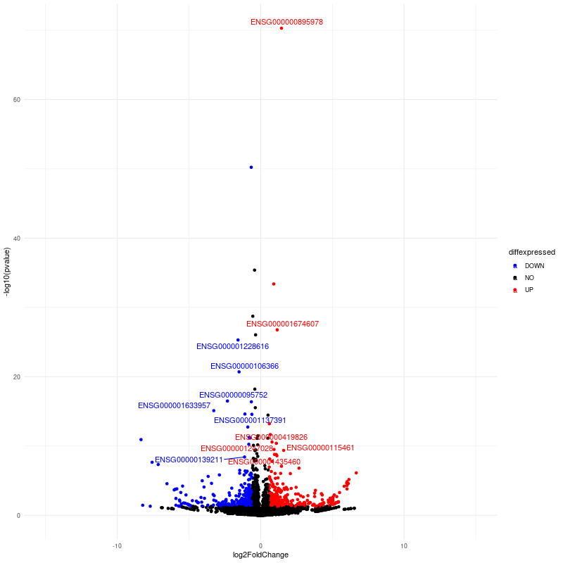

## Introduction

In this report we are going to do an analisis of RNA-seq data using the following pipeline, starting with the raw read RNA-seq data from the experiment SRP127520 **"Knockdown of FOXP1 promotes the development of lung adenocarcinoma"**.

## Pipeline

#### Quality control

The first step in our pipeline for the analysis is to make a quality report of the raw reads we are provided in order to assess possible quality control strategies and therefore be able to make good conclusion from the full analysis.

For the quality report we are going to use the Multiqc module, using the fastq files stored in the following path

```{bash eval = F}
/mnt/Timina/bioinfoII/rnaseq/tarea/data/SRP127520
```
 
The following script was used for downloading of raw data files and making a multiqc quality control report of said data files.

```{bash eval = F}
#!/bin/bash
# Use current working directory
#$ -cwd
#
# Join stdout and stderr
#$ -j y
#
# Run job through bash shell
#$ -S /bin/bash
#
#You can edit the script since this line
#
# Your job name
#$ -N MULTIQC
#
# Send an email after the job has finished
#$ -m e
#$ -M sogusama02@gmail.com
#
#
# If modules are needed, source modules environment (Do not delete the next line):
. /etc/profile.d/modules.sh
#
# Add any modules you might require:
module load fastqc/0.11.3
module load multiqc/1.5
#
# Write your commands in the next line
fastqc /mnt/Timina/bioinfoII/rnaseq/tarea/data/SRP127520/SRR6417885.sra_1.fastq.gz -o .
fastqc /mnt/Timina/bioinfoII/rnaseq/tarea/data/SRP127520/SRR6417885.sra_2.fastq.gz -o .
fastqc /mnt/Timina/bioinfoII/rnaseq/tarea/data/SRP127520/SRR6417886.sra_1.fastq.gz -o .
fastqc /mnt/Timina/bioinfoII/rnaseq/tarea/data/SRP127520/SRR6417886.sra_2.fastq.gz -o .
fastqc /mnt/Timina/bioinfoII/rnaseq/tarea/data/SRP127520/SRR6417887.sra_1.fastq.gz -o .
fastqc /mnt/Timina/bioinfoII/rnaseq/tarea/data/SRP127520/SRR6417887.sra_2.fastq.gz -o .
fastqc /mnt/Timina/bioinfoII/rnaseq/tarea/data/SRP127520/SRR6417888.sra_1.fastq.gz -o .
fastqc /mnt/Timina/bioinfoII/rnaseq/tarea/data/SRP127520/SRR6417888.sra_2.fastq.gz -o .
fastqc /mnt/Timina/bioinfoII/rnaseq/tarea/data/SRP127520/SRR6417889.sra_1.fastq.gz -o .
fastqc /mnt/Timina/bioinfoII/rnaseq/tarea/data/SRP127520/SRR6417889.sra_2.fastq.gz -o .
fastqc /mnt/Timina/bioinfoII/rnaseq/tarea/data/SRP127520/SRR6417890.sra_1.fastq.gz -o .
fastqc /mnt/Timina/bioinfoII/rnaseq/tarea/data/SRP127520/SRR6417890.sra_2.fastq.gz -o .
multiqc .
```

The following code was used for running the previous bash script.

```{bash eval = F}
cd /mnt/Timina/bioinfoII/ssalazar/rna-seq/tarea/out/QC
qsub multiqc1.sge
```

And downloading the multiqc report in the local computer

```{bash eval = F}
rsync -rptuvl ssalazar@dna.lavis.unam.mx:/mnt/Timina/bioinfoII/ssalazar/rna-seq/tarea/out/QC/multiqc_report1.html .
```

Based on the report, we are discarding sequences with less than 30Q and also trimming the ILLUMINA adapter sequences, as there seems to be a high adapter content in a lot of sequences, as shown in the following graph.

```{r echo=FALSE}

```

#### Trimming

For the trimming, we are using the trimmomatic tool, using the following arguments

**PE:** Because we are using paired end sequences

**-phred33:** We are specifing the base quality encoding

**ILLUMINACLIP:** We use the adapters in the fasta file, :2:30:10 are mismatch/accuracy treshold for adapter/reads pairing.

**SLIDINGWINDOW:5:30** Scaning the reads in a 5 base window. If mean quality under 15 in that window, the read is trimmed in the leftmost position of the window.

**MINLEN:** is the minimum length of reads we are accepting, if they are shorted after trimming, we discard them.

The full script, adding the command to create a multiqc report of the trimmed sequences is the following:

```{bash eval = F}
#!/bin/bash
# Use current working directory
#$ -cwd
#
# Join stdout and stderr
#$ -j y
#
# Run job through bash shell
#$ -S /bin/bash
#
#You can edit the script since this line
#
# Your job name
#$ -N PEtrimming
#
# Send an email after the job has finished
#$ -m e
#$ -M sogusama02@gmail.com
#
#
# If modules are needed, source modules environment (Do not delete the next line):
. /etc/profile.d/modules.sh
#
# Add any modules you might require:
module load trimmomatic/0.33
module load fastqc/0.11.3
module load multiqc/1.5
#
# Write your commands in the next line
trimmomatic PE -phred33 -basein /mnt/Timina/bioinfoII/rnaseq/tarea/data/SRP127520/SRR6417885.sra_1.fastq.gz -baseout ./SRR6417885_trmd.sra.fastq.gz ILLUMINACLIP:/mnt/Timina/bioinfoII/ssalazar/rna-seq/tarea/data/adapters/adapters-paired.fa:2:30:10 SLIDINGWINDOW:5:30 MINLEN:40
trimmomatic PE -phred33 -basein /mnt/Timina/bioinfoII/rnaseq/tarea/data/SRP127520/SRR6417886.sra_1.fastq.gz -baseout ./SRR6417886_trmd.sra.fastq.gz ILLUMINACLIP:/mnt/Timina/bioinfoII/ssalazar/rna-seq/tarea/data/adapters/adapters-paired.fa:2:30:10 SLIDINGWINDOW:5:30 MINLEN:40
trimmomatic PE -phred33 -basein /mnt/Timina/bioinfoII/rnaseq/tarea/data/SRP127520/SRR6417887.sra_1.fastq.gz -baseout ./SRR6417887_trmd.sra.fastq.gz ILLUMINACLIP:/mnt/Timina/bioinfoII/ssalazar/rna-seq/tarea/data/adapters/adapters-paired.fa:2:30:10 SLIDINGWINDOW:5:30 MINLEN:40
trimmomatic PE -phred33 -basein /mnt/Timina/bioinfoII/rnaseq/tarea/data/SRP127520/SRR6417888.sra_1.fastq.gz -baseout ./SRR6417888_trmd.sra.fastq.gz ILLUMINACLIP:/mnt/Timina/bioinfoII/ssalazar/rna-seq/tarea/data/adapters/adapters-paired.fa:2:30:10 SLIDINGWINDOW:5:30 MINLEN:40
trimmomatic PE -phred33 -basein /mnt/Timina/bioinfoII/rnaseq/tarea/data/SRP127520/SRR6417889.sra_1.fastq.gz -baseout ./SRR6417889_trmd.sra.fastq.gz ILLUMINACLIP:/mnt/Timina/bioinfoII/ssalazar/rna-seq/tarea/data/adapters/adapters-paired.fa:2:30:10 SLIDINGWINDOW:5:30 MINLEN:40
trimmomatic PE -phred33 -basein /mnt/Timina/bioinfoII/rnaseq/tarea/data/SRP127520/SRR6417890.sra_1.fastq.gz -baseout ./SRR6417890_trmd.sra.fastq.gz ILLUMINACLIP:/mnt/Timina/bioinfoII/ssalazar/rna-seq/tarea/data/adapters/adapters-paired.fa:2:30:10 SLIDINGWINDOW:5:30 MINLEN:40
fastqc ./SRR6417885* -o /mnt/Timina/bioinfoII/ssalazar/rna-seq/tarea/out/QC2
fastqc ./SRR6417886* -o /mnt/Timina/bioinfoII/ssalazar/rna-seq/tarea/out/QC2
fastqc ./SRR6417887* -o /mnt/Timina/bioinfoII/ssalazar/rna-seq/tarea/out/QC2
fastqc ./SRR6417888* -o /mnt/Timina/bioinfoII/ssalazar/rna-seq/tarea/out/QC2
fastqc ./SRR6417889* -o /mnt/Timina/bioinfoII/ssalazar/rna-seq/tarea/out/QC2
fastqc ./SRR6417890* -o /mnt/Timina/bioinfoII/ssalazar/rna-seq/tarea/out/QC2
multiqc /mnt/Timina/bioinfoII/ssalazar/rna-seq/tarea/out/QC2
```

The following commands were used for running the script

```{bash eval = F}
cd /mnt/Timina/bioinfoII/ssalazar/rna-seq/tarea/out/trimmed
qsub trimming-qc.sge
```

And downloading the multiqc report

```{bash eval = F}
rsync -rptuvl ssalazar@dna.lavis.unam.mx:/mnt/Timina/bioinfoII/ssalazar/rna-seq/tarea/out/QC2/multiqc_report2.html .
```

After trimming, we can see that the adapter content was significantly reduced and also we see that we have a clear GC, distribution, meaning that we don't have sequences that may be overepresented and therefore giving us a distrurbed distribution.

```{r echo=FALSE}

```

```{r echo=FALSE}
knitr::include_graphics('2-fastqc_per_sequence_gc_content_plot.png')
```

#### Alignment

In order to do the alignment, we are using transcriptome mapping because we have paired end sequences, the human transcriptome is already annotated and we are mainly interested in count differences between two groups. Therefore we are using `kallisto`.

We first download the reference transcriptome from GENCODE.

```{bash eval = F}
cd /mnt/Timina/bioinfoII/ssalazar/rna-seq/tarea
mkdir resources
cd resources
wget http://ftp.ebi.ac.uk/pub/databases/gencode/Gencode_human/release_38/gencode.v38.transcripts.fa.gz
```

Then we make the transcriptome index in order to be able to align our reads.

```{bash eval = F}
module load kallisto/0.45.0
kallisto index -i index_kallisto45_gencode_human_v38 gencode.v38.transcripts.fa.gz
```

#### Quantification

We first make directories for each sample, using the following commands.

```{bash eval = F}
cd /mnt/Timina/bioinfoII/ssalazar/rna-seq/tarea/out
mkdir kallisto 
ls ../trimmed/ | perl -pe 's/(SRR\d+)_trmd.*/mkdir $1/' | uniq
mkdir SRR6417885
mkdir SRR6417886
mkdir SRR6417887
mkdir SRR6417888
mkdir SRR6417889
mkdir SRR6417890
```
We generate the lines for our bash script with the following code.

```{bash eval = F}
ls | grep "SRR" | perl -pe 's/(SRR\d+)/kallisto quant -i ..\/..\/resources\/index_kallisto45_gencode_human_v38 -o .\/$1 ..\/trimmed\/$1* /'
```
This is the full bash script:

```{bash eval = F}
#!/bin/bash
# Use current working directory
#$ -cwd
#
# Join stdout and stderr
#$ -j y
#
# Run job through bash shell
#$ -S /bin/bash
#
#You can edit the scriptsince this line
#
# Your job name
#$ -N Quantification
#
# Send an email after the job has finished
#$ -m e
#$ -M sogusama02@gmail.com
#
#
# If modules are needed, source modules environment (Do not delete the next line):
. /etc/profile.d/modules.sh
#
# Add any modules you might require:
module load kallisto/0.45.0
#
# Write your commands in the next line
kallisto quant -i ../../resources/index_kallisto45_gencode_human_v38 -o ./SRR6417885 ../trimmed/SRR6417885* 
kallisto quant -i ../../resources/index_kallisto45_gencode_human_v38 -o ./SRR6417886 ../trimmed/SRR6417886* 
kallisto quant -i ../../resources/index_kallisto45_gencode_human_v38 -o ./SRR6417887 ../trimmed/SRR6417887* 
kallisto quant -i ../../resources/index_kallisto45_gencode_human_v38 -o ./SRR6417888 ../trimmed/SRR6417888* 
kallisto quant -i ../../resources/index_kallisto45_gencode_human_v38 -o ./SRR6417889 ../trimmed/SRR6417889* 
kallisto quant -i ../../resources/index_kallisto45_gencode_human_v38 -o ./SRR6417890 ../trimmed/SRR6417890* 
```

We run the script with the command:

```{bash eval = F}
qsub quantification.sge
```

#### Data integration

Using `tximport` in order to import our data in a way we can work with.

Setting R in the cluster since `tximport` is run from there.

```{bash eval = F}
qlogin
cd /mnt/Timina/bioinfoII/ssalazar/rna-seq/tarea/out/kallisto
module load r/4.0.2
R
```

We first extract the names of the samples from the directories we previously created, and save them in our `files` variable.

```{r eval=FALSE}
library(tximport)
library(tidyverse)
files <- file.path("/mnt/Timina/bioinfoII/ssalazar/rna-seq/tarea/out/kallisto", list.dirs("."), "abundance.h5")
names(files) <- str_extract(files,"SRR\\d+")
files <- files[c(2, 3, 4, 5, 6, 7)]
```

Transcripts need to be associated with gene IDs for gene-level summarization, since for kallisto, the files only provide the transcript ID, we first make a data.frame called tx2gene with two columns: 1) transcript ID and 2) gene ID, using the genes information downloaded from GENCODE.

```{r eval=FALSE}
# transcript id - gene id correspondence
tx2gene <- read.csv("/mnt/Timina/bioinfoII/rnaseq/resources/gencode/gencode.v38.basic.pc.transcripts.enstid_ensgid-nover.csv",stringsAsFactors = F)
# transcript id - gene name correspondence
tx2genename <- read.csv("/mnt/Timina/bioinfoII/rnaseq/resources/gencode/gencode.v38.basic.pc.transcripts.enstid_genename-nover.csv",stringsAsFactors = F)
```


Runing tximport to summarize transcript-level abundance estimates for transcript and gene-level analysis.

```{r eval=FALSE}
txi.kallisto <- tximport(files, type = "kallisto", tx2gene = tx2gene, ignoreAfterBar=TRUE, ignoreTxVersion=TRUE)
txi.kallisto.name <- tximport(files, type = "kallisto", tx2gene = tx2genename, ignoreAfterBar=TRUE, ignoreTxVersion=TRUE)
```

When running the following command, we can see the counts for some genes, separated by sample.

```{r eval=FALSE}
head(txi.kallisto$counts)
```


#### Normalization

We need to normalize in order to account for potential biases in our data, this could involve transcripts with a lot of counts due to just a bigger gene fragment and making the analysis look like its differentially expressed when it's not. 

It's important to note that we considered that batch effect correction was not needed as in the SRA Run page we can see that each sample corresponds to a single run of sequencing.

Normalization and differential expression analysis was done with the `DESeq2` R package. Following the previous R commands, we continue with the next commands.

We first load the samples information, which is downloaded from the SRA Run page in GEO.

```{r eval=FALSE}
samples <- read.csv("/mnt/Timina/bioinfoII/ssalazar/rna-seq/tarea/resources/samples.csv",stringsAsFactors = F, header = TRUE)
```

`Run` is the variable with the sample name, as we only have one run per sample.

```{r eval=FALSE}
samples <- column_to_rownames(samples, var = "Run")
```

Then we perform our differential expression analysis, giving in `design`, our variable of interest which would be the condition of the sample, e.g whether is a wild type or FOXP1 knockdown sample.

```{r eval=FALSE}
library(DESeq2)
dds <- DESeqDataSetFromTximport(txi.kallisto,
                                   colData = samples,
                                   design = ~ Genotype)
```

We filter reads with less than 10 counts as used in `DESeq2` documentation.

```{r eval=FALSE}
keep <- rowSums(counts(dds)) >= 10
dds <- dds[keep, ]
dds$Genotype <- factor(dds$Genotype, levels = c("wild type","FOXP1 knockdown"))
dds <- DESeq(dds)
res <- results(dds)
summary(res)
```

We get that around 1.7% of genes can be considered upregulated and 2.1% downregulated.

Lowering the threshold on padj, we get that 1.2% genes are upregulated and 1.7% downregulated.

```{r eval=FALSE}
res.05 <- results(dds, alpha = 0.05)
summary(res.05)
```


Using the differential expression analysis we can apply filters to the `padj` value in order to create graphs to view the information.

```{r eval=FALSE}
resSig <- subset(res, padj < 0.1)
head(resSig[ order(resSig$log2FoldChange, decreasing = T), ])
```

#### Volcano plot

In order to visualize the normalized data we can make use, in this case, of a volcano plot. In this way, we will be able to easily account for the genes that have a higher p-value significance. The following plots were made with slight changes in the creation commands.

```{r eval=FALSE}
library(ggplot2) # we load ggplot2
outdir = "/mnt/Timina/bioinfoII/bvillalobos/rna-seq/results/"
png(file = paste0(outdir,"volcano01-res.png"),
    width = 800, height = 800) # we will save as a png
# The basic scatter plot: x is "log2FoldChange", y is "pvalue"
ggplot(data=as.data.frame(res), aes(x=log2FoldChange, y=pvalue)) +
  geom_point() # scatter plot
dev.off()
```

```{r echo=FALSE}

```

We then make a more clear version of the plot:

```{r eval=FALSE}
png(file = paste0(outdir,"volcano02-res.png"),
    width = 800, height = 800) # save as a png
ggplot(data=as.data.frame(res), aes(x=log2FoldChange, y=-log10(pvalue))) +
  geom_point() # scatter plot
dev.off()
```

```{r echo=FALSE}

```

Then we mark a threshold for significance.

```{r eval=FALSE}
png(file = paste0(outdir,"volcano03-res.png"),
    width = 800, height = 800) # save as png
ggplot(data=as.data.frame(res), aes(x=log2FoldChange, y=-log10(pvalue))) +
  geom_point() + # scatter plot
  theme_minimal() +
  geom_vline(xintercept=c(-0.6, 0.6), col="red") + # vertical lines for log2FoldChange thresholds
  geom_hline(yintercept=-log10(0.05), col="red") + # horizontal line for the p-value threshold
  xlim(-15,15)
dev.off()
```

```{r echo=FALSE}
knitr::include_graphics('volcano03-res.png')
```

We can classify our data by the given threshold in down, up and no differentially expressed. 

```{r eval=FALSE}
# Add a column to the data frame to specify if they are UP- or DOWN- regulated (log2FoldChange respectively positive or negative)
de <- as.data.frame(res)
# add a column of NAs
de$diffexpressed <- "NO"
# if log2Foldchange > 0.6 and pvalue < 0.05, set as "UP" 
de$diffexpressed[de$log2FoldChange > 0.6 & de$pvalue < 0.05] <- "UP"
# if log2Foldchange < -0.6 and pvalue < 0.05, set as "DOWN"
de$diffexpressed[de$log2FoldChange < -0.6 & de$pvalue < 0.05] <- "DOWN"
png(file = paste0(outdir,"volcano04-res.png"),
    width = 800, height = 800) # save as png
ggplot(data=de, aes(x=log2FoldChange, y=-log10(pvalue), col=diffexpressed)) + 
  geom_point() + theme_minimal() + 
  geom_vline(xintercept=c(-0.6, 0.6), col="red") +
  geom_hline(yintercept=-log10(0.05), col="red") +
  xlim(-15,15)
dev.off()
```

```{r echo=FALSE}

```


Finally, we can create a plot adding the names of the genes of interest.

```{r eval=FALSE}
library(ggrepel)
de$names <- NA
filter <- which(de$diffexpressed != "NO" & de$padj < 0.05 & (de$log2FoldChange >= 1 | de$log2FoldChange <= -1))
de$names[filter] <- rownames(de)[filter]
png(file = paste0(outdir,"volcano05-res.png"),
    width = 800, height = 800)
ggplot(data=de, aes(x=log2FoldChange, y=-log10(pvalue), col=diffexpressed, label=names)) +
    geom_point() +
    scale_color_manual(values=c("blue", "black", "red")) + # cambiar colores de puntos
    theme_minimal() +
    geom_text_repel() +
    xlim(-15,15)
dev.off()
```

```{r echo=FALSE}

```

#### Functional enrichment analysis

We also make a functional analysis with Gene Ontology information in order to contextualize our results. We use the `g:Profiler` R package to create the graphs and the analysis.

We create a graph for the downregulated genes, using a `padj` threshold of $<0.01$ and a `log2FoldChange` value of $-2$ as in the original paper these parameters were considered for differentially expressed genes.

```{r eval=FALSE}
library(ggrepel)
library(gprofiler2)
library(forcats)
# Downregulated genes
resSig <- subset(res, padj < 0.01 & log2FoldChange < -2)
resSig <- resSig[ order(resSig$log2FoldChange, decreasing = TRUE), ]
# gene lists
DEG <- rownames(resSig)
genes_universe <- rownames(dds)
gostres = gost(query = DEG, organism = "hsapiens", significant = T, 
               correction_method = "fdr", domain_scope = "custom", 
               custom_bg = genes_universe, ordered_query = TRUE)
library(ggplot2)
outdir = "/mnt/Timina/bioinfoII/ssalazar/rna-seq/tarea/results/"
go <- as.data.frame(gostres$result)
png(file = paste0(outdir,"downregulated.png"),
    width = 1800, height = 800)
go %>%
  dplyr::slice(1:15) %>%
  select(p_value, term_name) %>%
  mutate(go = fct_reorder(term_name, p_value)) %>%
  ggplot( aes(x=go, y=p_value)) +
  geom_bar(stat="identity", fill="#3A68AE", alpha=.6, width=.4) +
  coord_flip() +
  labs(x = "", y = "Adjusted P-value") +
  theme_bw(base_size = 20)

dev.off()
```

The following functions were shown affected when looking at the downregulated genes.

```{r echo=FALSE, out.width='100%', out.height='100%'}

```

Then we create the same graph for the upregulated genes using the same previous parameters.

```{r eval = F}
# Upregulated genes
resSig <- subset(res, padj < 0.01 & log2FoldChange > 2) # subset
resSig <- resSig[ order(resSig$log2FoldChange, decreasing = TRUE), ]
DEG <- rownames(resSig)
genes_universe <- rownames(dds)
gostres = gost(query = DEG, organism = "hsapiens", significant = T, 
               correction_method = "fdr", domain_scope = "custom", 
               custom_bg = genes_universe, ordered_query = TRUE)
go <- as.data.frame(gostres$result)
png(file = paste0(outdir,"upregulated.png"),
    width = 1800, height = 800)
go %>%
  dplyr::slice(1:15) %>%
  select(p_value, term_name) %>%
  mutate(go = fct_reorder(term_name, p_value)) %>%
  ggplot( aes(x=go, y=p_value)) +
  geom_bar(stat="identity", fill="#3A68AE", alpha=.6, width=.4) +
  coord_flip() +
  labs(x = "", y = "Adjusted P-value") +
  theme_bw(base_size = 20)

dev.off()

```

The following functions were shown affected when looking at the upregulated genes.

```{r echo=FALSE}

```

## Discusion

In the paper it was concluded that FOXP1 is indeed downregulated in lung adenocarcinoma. Genes that are related to chemokine signalling pathways are downstream events of FOXP1 effects (Sheng, et. al). Therefore, in the absence of FOXP1 it would make sense for them to be downregulated too. In the downregulated GO functional analysis plot, we observe that the cytokines and inflamatory response is present, as well as some other function involving interleukins. The glucocortidcoid receptor pathway is also represented. 

Chemokines are chemoattractive cytokines and it is known that glucocorticoids have an inhibitory effect on production of cytokines (Miyamasu, et. al). Therefore there may be a relation between this inhibitory effect and the downregulation of FOXP1 which also downregulates genes in the chemokine signalling pathway as well as affecting other cytokines's signalling.

In the analysis we can also see in the upregulated GO graph that growth factor and complexes are represented. In the paper they mentioned that it has been shown that the expression of GNG7, which  functions as a tumor suppressor in other cancers, was however incresed in lung cancer cells after the knockdown of FOXP1, suggesting that it may exert oncogenic effects in lung cancer (Sheng, et. al). Therefore it would make sense to also have these representations of growth factors in the upregulated GO analysis graph.

## Conclusion

This time we learned how to analize RNA-seq data. At first we could evaluate the quality of the reads by using the `multiqc` tool, which helped us discard the low quality
sequences. We then made use of a trimming algorithm and the use of adapters to improve th quality of our reads. We also implemented the `kallisto` and `tximport` packages and we managed to 
take indices and alignments for the data given. We can mention as a central topic the normalization step, and the multiple techniques that can be used, although here the `deseq2` module
was enough. After that, we could take several ways to analize the normalized data, as MA plots or volcano plots (used here).

Finally, we were able to summarize our results in a graphical way by contextualizing with a gene functional analysis.

## References

- Bolger, A. M., Lohse, M., & Usadel, B. (2014). Trimmomatic: A flexible trimmer for Illumina Sequence Data. Bioinformatics, btu170. Retrieved 15 March 2022, from http://www.usadellab.org/cms/?page=trimmomatic

- GENCODE Project. (n.d). GENCODE Release Files Description. Retrieved 17 March 2022, from http://ftp.ebi.ac.uk/pub/databases/gencode/Gencode_human/latest_release/_README.TXT

- Hua Sheng, Xiangyang Li & Yi Xu (2019) Knockdown of FOXP1 promotes the development of lung adenocarcinoma, Cancer Biology & Therapy, 20:4, 537-545, DOI: 10.1080/15384047.2018.1537999

- Kallisto. (n.d). Manual.  Retrieved 16 March 2022, from https://pachterlab.github.io/kallisto/manual

- Kolberg, L., Raudvere, U. (2021). gprofiler2: Interface to the 'g:Profiler' Toolset. Retrieved 20 March 2022, from https://cran.r-project.org/web/packages/gprofiler2/index.html

- Love, M., Soneson, C., Robinson, M. (2021). Importing transcript abundance with tximport. Retrieved 14 March 2022, from https://bioconductor.org/packages/release/bioc/vignettes/tximport/inst/doc/tximport.html

- Miyamasu, M., Misaki, Y., et. al (1998) Glucocorticoids inhibit chemokine generation by human eosinophils, Journal of Allergy and Clinical Immunology. Vol. 101, Issue 1, 75-83, DOI: 10.1016/S0091-6749(98)70196-4


